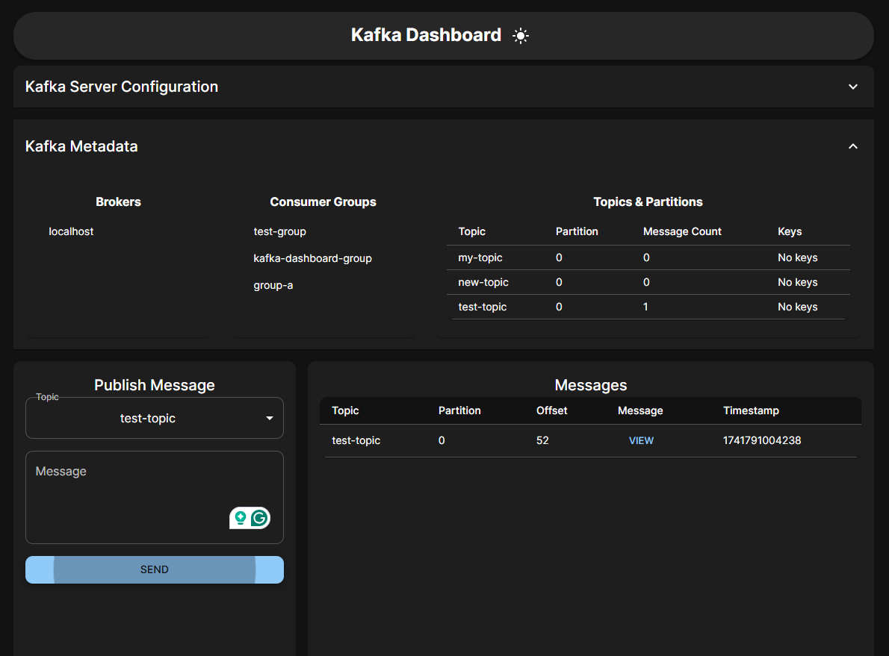
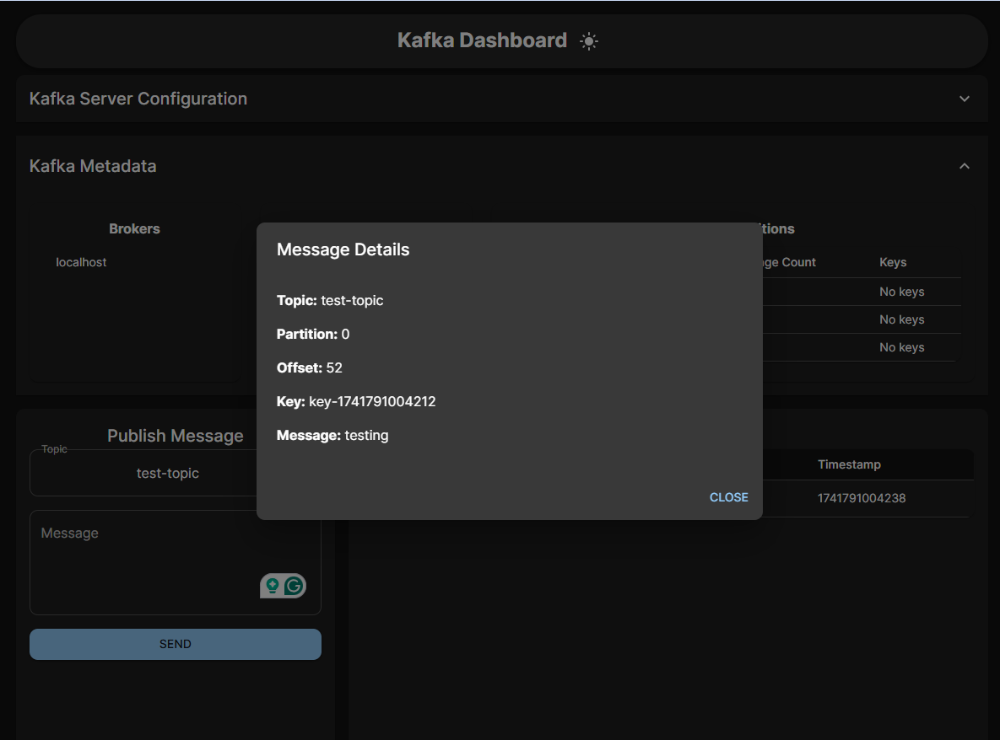

# Kafka Dashboard

## Overview

The **Kafka Dashboard** is a **React + TypeScript + Material UI** web application that allows users to **publish, consume, and monitor** Kafka messages. It provides real-time insights into Kafka topics, partitions, consumer groups, and metadata in a visually appealing and interactive UI.

## Features

✅ **Publish & Consume Kafka Messages**  
✅ **Monitor Kafka Topics, Partitions, Offsets, and Keys**  
✅ **View Consumer Groups & Broker Details**  
✅ **Dark Mode Toggle** (with Theme Persistence)  
✅ **Pagination & Column Filtering**  
✅ **Configurable Kafka Server Settings**  
✅ **Live Kafka Metadata Updates**  
✅ **Modern UI with Curved Corners & Responsive Design**

---

## 🚀 Getting Started

### **1. Prerequisites**

Ensure you have the following installed:

- **Node.js** (v18+ recommended)
- **Docker** (for running Kafka)
- **KafkaJS** (Node.js client for Kafka)

### **2. Clone the Repository**

```sh
git clone https://github.com/uttesh/kafkaclient.git
cd kafkaclient
```

### **3. Start Kafka (No Zookeeper)**

Run Kafka & Schema Registry using Docker Compose:

```sh
docker-compose up -d
```

#### **📝 `docker-compose.yml` (No Zookeeper)**

```yaml
version: "3.8"
services:
  kafka:
    image: "bitnami/kafka:latest"
    ports:
      - "9092:9092"
    environment:
      - KAFKA_CFG_NODE_ID=0
      - KAFKA_CFG_PROCESS_ROLES=controller,broker
      - KAFKA_CFG_CONTROLLER_QUORUM_VOTERS=0@localhost:9093
      - KAFKA_CFG_LISTENERS=PLAINTEXT://0.0.0.0:9092,CONTROLLER://0.0.0.0:9093
      - KAFKA_CFG_LISTENER_SECURITY_PROTOCOL_MAP=CONTROLLER:PLAINTEXT,PLAINTEXT:PLAINTEXT
      - KAFKA_CFG_CONTROLLER_LISTENER_NAMES=CONTROLLER
```

---

## 🔧 Setup & Installation

### **4. Install Dependencies**

```sh
# Install frontend dependencies
cd client
npm install

# Install backend dependencies
cd ../server
npm install
```

### **5. Configure Kafka Server in UI**

Once the app is running, configure the Kafka **bootstrap servers, topics, and groups** directly from the UI settings panel.

### **6. Start the Server**

```sh
npx ts-node server.ts
```

### **7. Start the Frontend**

```sh
cd client
npm run dev
```

The application will be available at **`http://localhost:3000`**

---

## 📌 Project Structure

```
kafka-dashboard/
│── client/                 # React Frontend (TypeScript + MUI)
│   ├── src/
│   │   ├── components/     # UI Components (Tables, Forms, Modals)
│   │   ├── context/        # Theme & Kafka Contexts
│   │   ├── pages/          # Dashboard & Settings Pages
│   │   ├── App.tsx         # Main App Component
│   │   ├── main.tsx        # ReactDOM Render
│   │   ├── theme.ts        # Custom MUI Theme
│   │   ├── api.ts          # Kafka API Calls
│   ├── package.json        # Frontend Dependencies
│
│── server/                 # Node.js Backend (Express + KafkaJS)
│   ├── src/
│   │   ├── kafka/          # Kafka Producer & Consumer
│   │   ├── routes/         # API Routes
│   │   ├── server.ts       # Express Server
│   ├── package.json        # Backend Dependencies
│
│── docker-compose.yml      # Kafka (No Zookeeper)
│── README.md               # Documentation
```

---

## 🌟 UI Preview

### **Dashboard**

- **Modern MUI-based UI with curved corners**
- **Topic & Consumer Group Monitoring**
- **Dark Mode Toggle**
- **Live Kafka Messages in Table with Pagination**

### **Kafka Configuration Panel**

- **Update Kafka Broker Configurations in UI**
- **View Consumer Groups, Partitions, and Metadata**

### **📸 Application Screenshot**




---

## 🎯 API Endpoints

### **Producer API (Publish Message)**

```http
POST /api/kafka/publish
```

```json
{
  "topic": "my-topic",
  "key": "message-key",
  "value": "Hello, Kafka!"
}
```

### **Consumer API (Fetch Messages)**

```http
GET /api/kafka/messages
```

Returns messages along with **offset, partition, and key** details.

### **Kafka Metadata API**

```http
GET /api/kafka/metadata
```

Returns **brokers, topics, partitions, consumer groups**.

---

## 🛠️ Built With

- **React + TypeScript** - Frontend
- **Material UI (MUI)** - Styling & Components
- **KafkaJS** - Kafka Client for Node.js
- **Express.js** - Backend API
- **Docker** - Kafka Deployment (No Zookeeper)

---

## 📌 Future Enhancements

- 📊 **Real-time WebSocket Updates** for Messages
- 📉 **Kafka Metrics & Charts** for Visualization
- 🔄 **Custom Kafka Retention Policies & Alerts**

---

## 🤝 Contributing

1. Fork the repo
2. Create a feature branch (`git checkout -b feature-name`)
3. Commit your changes (`git commit -m 'Added new feature'`)
4. Push to the branch (`git push origin feature-name`)
5. Open a PR 🚀

---

## 📜 License

This project is licensed under the **MIT License**.

---

## 📞 Support

For any issues or feature requests, create an **[Issue](https://github.com/uttesh/kafkaclient/issues)** or reach out via email.

🚀 **Happy Coding with Kafka!** 🎉
